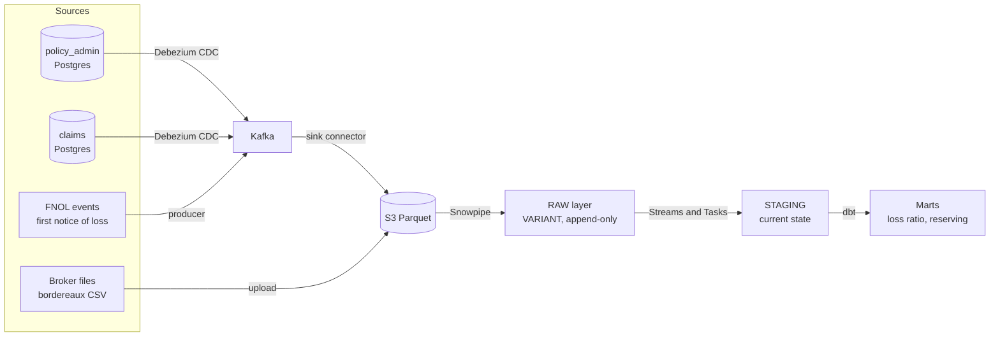

## The shape of the system

Data enters from several places, converges in Snowflake, and is refined in layers.

## The three ingestion paths

Each path exists because the sources behave differently. Using one mechanism for all of them would be wrong.

<Tabs>
  <Tab title="Path 1 — Database CDC">
    **Source:** the two Postgres systems.

    Every insert, update and delete is read out of the database's transaction log and published to Kafka as an event. No queries are run against the source, so there is no load on the production system and no polling window in which changes can be missed.

    This is the primary path and carries most of the volume.
  </Tab>
  <Tab title="Path 2 — Streaming events">
    **Source:** FNOL (First Notice of Loss) events — the moment a customer reports an incident, before a formal claim record exists.

    These arrive as a continuous stream and feed a live operations view. They are genuinely real-time: a claims manager watching a storm roll in needs to see reports in the last few minutes, not this morning's batch.
  </Tab>
  <Tab title="Path 3 — File delivery">
    **Source:** broker bordereaux — spreadsheets of policies and claims sold through intermediaries, delivered daily or weekly.

    Files are the oldest integration pattern in insurance and are not going away. They need arrival detection, schema validation, and a quarantine path for bad files, which is why this path needs an orchestrator and the other two do not.
  </Tab>
</Tabs>

<Note>
**Why path 3 needs Airflow and path 1 does not.** Paths 1 and 2 are event-driven — something happened, so a message exists. Path 3 must detect **absence**: the broker file that did not arrive by 9am is the problem, and you cannot build an event out of nothing happening. Detecting absence requires a scheduler.
</Note>

## The layers in Snowflake

<Steps>
  <Step title="RAW">
    Events land exactly as they arrived, in a `VARIANT` column, append-only. Nothing is interpreted, nothing is discarded. If a transformation turns out to be wrong six months from now, the original is still here to rebuild from.
  </Step>
  <Step title="STAGING">
    The change stream is collapsed into current-state tables — one row per policy, per claim. Built with Snowflake Streams and Tasks, which track what is new since the last run.
  </Step>
  <Step title="MARTS">
    Business-meaningful tables built with dbt: loss ratios, reserving triangles, claims-operations metrics. This is the only layer analysts are expected to query.
  </Step>
</Steps>

<Tip>
This bronze / silver / gold pattern is often called **medallion architecture**. The value of it is that each layer has exactly one job, so when a number is wrong you can tell which layer is lying.
</Tip>

## Infrastructure ownership

Different tools own different parts, deliberately — each is best at one job and the boundaries keep deployments from fighting each other.

| Component | Managed by |
| --- | --- |
| AWS resources (S3, networking, MSK, compute) | AWS CDK (Python) |
| Snowflake databases, schemas, roles, warehouses | schemachange |
| Snowflake models from staging upward | dbt |
| Debezium connector configuration | CI, posted to the Kafka Connect REST API |
| Local development environment | Docker Compose |
